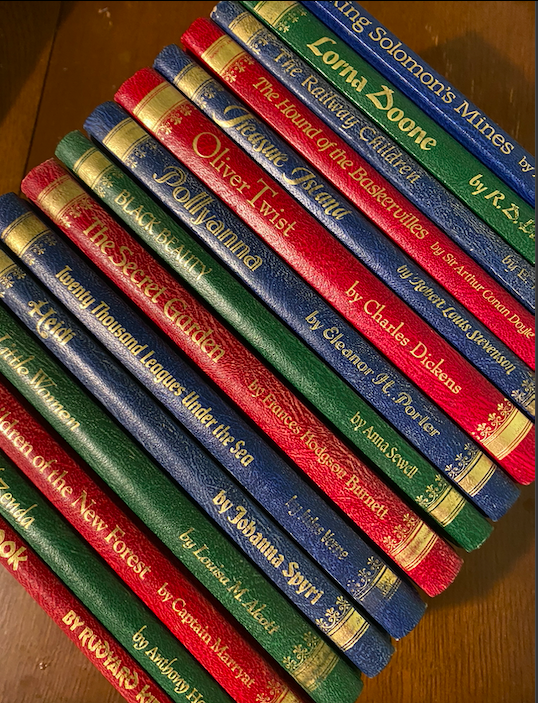
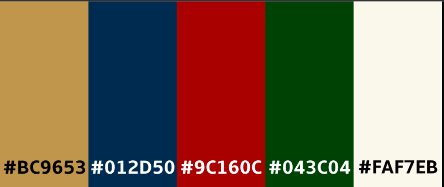

# Pocket Bookcase

Here is a [link](https://pocket-bookcase.herokuapp.com/) to the live project.

This website was created for Milestone 3 - Datacentric Development project, as part of the Code Institutes diploma in Software development. 
I love books and have the problem of never remembering what book I'm on in the numerous series that I'm in the middle of reading. This means I often start to read a book I've already read and buy books I already have at home. 
I was inspired by an app I used to have which doesn't seem to exist now which was for keeping track of which Terry Pratchett Discworld books that the user had read. It was just a simple list of the books with a checkbox beside them, but it did the trick and I thought how useful it would be to have it for any books. 
Upon pitching my idea to a few people, I was met with how useful that would be and how much they would use it, and so Pocket Bookcase was born.

## Contents 

- [User Experience (UX)](#user-experience-ux)
   * [Strategy](#strategy)
   * [User Stories](#user-stories) 
   * [Scope](#scope)
      + [Current Features](#current-features)
      + [Features to implement in the future](#features-to-implement-in-the-future)
   * [Structure](#structure)
   * [Skeleton](#skeleton)
   * [Surface](#surface)
     + [Colour Scheme](#colour-scheme)
     + [Typography](#typography)
     + [Imagery](#imagery)
- [Technologies](#technologies)
   * [Languages used](#languages-used)
   * [Frameworks, Libraries & Programs Used](#frameworks-libraries-&-programs-used)

- [Challenges](#challenges)

- [Testing](#testing)
   
- [Deployment](#deployment)

- [Credits](#credits)
   * [Code](#code)
   * [Content](#content)
   * [Media](#media)
   * [Acknowledgements](#acknowledgements)

## User Experience (UX)

   ### Strategy 
   - User goals 
     * As a user I want help keeping track of my books.
     * As a user I want to save my money and time by not buying books I already own or have read. 

   - Site owner/ business goals
     * As the site owner I want my site to be responsive to different screen sizes.
     * As the site owner I want my site to be accessible to my visitors.
     * As the site owner I want to build up media presence, to ultimately build up users so that I can earn money from affiliate links.
     * Ultimately though I want to use the application to track my own books.

   ### User Stories

   - #### First Time Visitor 

        1. As a first time visitor, I want to easily understand the main purpose of the site. 
        2. As a first time visitor, I want to be able to intuitively use the site.
        3. As a first time visitor, I expect to see an attractive, visually appealing site.
        4. As a first time visitor, I expect an accessible site.
        5. As a first time visitor, I expect the site to look good on my mobile device.
        6. As a first time visitor, I want to easily search the books.
        7. As a first time visitor, I want to easily register.

   - #### Returning Visitor Goals

        1. As a returning visitor, I want to add books to my "bookshelves".
        2. As a returning visitor, I want to follow on social media so I can hear of any new features.
        3. As a returning visitor, I want to be able to add books to the applications library.
        4. As a returning visitor, I want to be able to change my password.
        5. As a returning visitor, I want to be able to rate the app.
        6. As a returning visitor, I want to get feedback so I know that something has went through or if i've been redirected, why.

   - #### Frequent Visitor Goals

        1. As a frequent visitor, I want to be able to edit a book that I've added to the applications library.
        2. As a frequent visitor, I want to be able to contact the owner with suggestions.
        3. As a frequent visitor, I want to be able to move or delete books on my "bookshelves".
        4. As a frequent visitor, I want to be able to update my profile.
        5. As a frequent visitor, I want to be able to change my account information
        6. As a frequent visitor, I don't want to have never ending scrolling up or down.

   - #### Admin goals
      
        1. As admin, I want to be able to add, delete or edit a book.
        2. As admin, I want to be able to add, delete or edit a genre.
        3. As admin, I want to be able to delete a user.
        4. As admin, I want to be able to make another user an admin.
        5. As admin, I want to be able to reset a users password if they're having trouble logging in.

   ### Scope

   Within project conception, a list of features were compiled, these were the scored 
   between 1 & 5 for importance and feasibility/ viability which then decided which features 
   could be included for initial launch.    

   #### Current features 

-   Responsive on all device sizes

-   Accessible 

-   Easy to navigate (Single use learning)

-   Interactive elements

-   Social Links (build up media presence)

-   Ability to contact owner 

   #### Features to implement in the future

-   Book suggestions based on the users favourite genre, which will crosscheck which books are in the library of that genre, which books they have on their profile and display 1 or 2 books at random so they also aren't seeing the same suggestions everytime they log in.
- Users can add a review to books they didn't add.
- Users can rate books they didn't add, the rating displayed will then be the average.

### Structure

- Home/library page all users will be able to use regardless of whether they are logged in or not. The home page will have an add book button and add to profile buttons visible for logged in users. Those books that were added by the user will also have an edit button visible and admin will have a delete button in addition to the rest.  
- Add book button allows logged in users to add a new book to the library by filling out the form on the add-book page. 
- The add to profile buttons beside the books allows the user to add a book to their profile bookshelves, the profile-add page has two questions requiring a yes or no which determines which bookshelf(or bookshelves) the book gets added to. 
- The edit button beside a book allows the user that added it or admin to edit it on the edit-book page. The user can't change the title as they could potentially change it to a completely different book. The admin however can change the title i.e in the case of a spelling mistake. 
- The delete button beside the books are to allow admin to delete a book from the database, if required for any reason.  
- All users will have access to About and Contact pages. The nav links to these are therefore also seen by all. The about page explains to users what the purpose of the site is and how to use it and benefits of registering.  
- For logged in users the nav menu will change, sign-in and sign-up will be replaced with sign-out and profile, and the footer links will also change to sign me out and edit account links  
- Profile page has got the users name at the top and three collapsible bookshelves for their saved books, these books can be moved between bookshelves or removed entirely from the profile using the buttons beside the books themselves.  
- The edit-account page allows a user to change everything except their username, this was because any books they had added to the library would then not be available to them to edit as the username would not match up to the the added_by field attached to the books. They can also delete their account from this page, a confirmation of deletion is requested so that user can't accidentally delete account. 
- Admin users have additional nav links of manage genre and manage users. Manage user allows admin to delete a user, requiring confirmation prior to deletion. Edit will take admin to edit-user page. Here admin can make another user an admin, change their email address for them or their password if required. They are then prompted to contact user with password and the user would then log in and change their password again. Have put change password in a collapsible so that its not filled in by accident. 
- The manage genre page has a section at top to add a new genre wih submit button and edit just opens up an edit genre collapsible. I felt what with genre information being just that, the genre neither adding or editing warranted a seperate page. 
- Have added in error pages so that the user is shown a comforting error message and a button back to home, which in the event of an error doesn't put the user off from using again. 
- Created a database schema using [dbdiagram](https://dbdiagram.io/home), see below. 

### Skeleton 

Wireframes were created on Balsamiq (see links below)

* [Mobile](static/readme-assets/wireframes/ms3-mobile.pdf)
* [Tablet](static/readme-assets/wireframes/ms3-tablet.pdf)
* [Desktop](static/readme-assets/wireframes/ms3-desktop.pdf)

Changed a few things from the wireframes:
- Realised that having icons instead of buttons, may have looked better but felt if I needed a key to tell the users what they all meant it wasn't intuitive. Similarly for the checkboxes on the profile page, if the user had a small device and a few books they would have to scroll up to see the checkbox column titles.  
- Incorporated the add and edit genre pages into the manage genres page and added a manage users page.  
- Changed the look of the manage genres page to match that of the manage users page to keep things simple to use.  
- On mobile devices the cover image had to be really small to be side by side with the book information, toyed with the idea of not having the book cover image, but felt without the images, all the text was off putting, an image pulls you in. Due to the same issue for desktop, didn't have two books side by side as originally had planned, I think it definately looks better for it.

### Surface

 -   #### Colour Scheme
        
        In the past few years I have started collecting nice editions of the classics, I have always loved old books, the smell, the textures and the colours. This started with a weekly magazine that I collected as a child, you would get the magazine that told you all about the book and a nice copy of the book itself, bold colours with gold embellishment. 

         

        I used this to style my site, off white background colour to represent the colour of aged pages, the red, green, blue and gold for the numerous types of buttons as theses colours draw attention. In place of black I have used a dark brown to soften while retaining contrast, I have also used a warm brown for the horizontal rule to emulate the wooden shelves of a bookcase. Used [convertingcolors.com](https://convertingcolors.com/color-bucket.html) to create the image below to show the colors I took from the inspo image.
      
        

-   #### Typography
         
      Used [Google Fonts](https://fonts.google.com/) to import the fonts used for this site.
      I used 'Tangerine' for the titles and logo as it has that ornate handwriting style that you would often see on the cover of vintage books.
      For the main text I chose 'Gentium Book Basic' which does exactly what it says on the tin, it looks like the writing you would see inside any book, plain and easy to read.
      
-   #### Imagery
      The picture I have chosen for the site on every page is that of a full to the brim, bookcase. I want the user to feel like they are surrounded by books, books of adventure, romance, fantasy all at hand waiting for them to reach out and immerse themselves in another world so they can forget about theirs for a time.  
      It invokes memories of excitment of being in a book shop deciding what book to get next, or in a second hand or antique book shop wondering what treasure they'll find, or in the peacefulness of the library surrounded by knowledge just waiting to be gained.
      The other images on the site are the book covers which speak for themselves, I have got a backup image incase a url is not provided or doesn't work, it's a close up of a pile of books, which you can almost smell, adding to the feel of the site.

## Technologies 

### Languages Used

-   [HTML5](https://en.wikipedia.org/wiki/HTML5)
-   [CSS3](https://en.wikipedia.org/wiki/Cascading_Style_Sheets)
-   [JavaScript](https://en.wikipedia.org/wiki/JavaScript)
-   [Python](https://en.wikipedia.org/wiki/Python_(programming_language))

### Frameworks, Libraries & Programs Used

1. [Bootstrap v4.6.0](https://getbootstrap.com/docs/4.6.0/getting-started/introduction/)
    - Bootstrap was used for the initial layout and styling before customising it.
2. [Google Fonts](https://fonts.google.com/)
    - Google fonts were used to import the Noto Sans KR and Montserrat. 
3. [Font Awesome](https://fontawesome.com/)
    - Social media icons in footer and section icons on evidence page.
4. [Git](https://git-scm.com/)
    - Version control.
5. [GitHub](https://github.com/)
    - For storing project.
6. [Gitpod](https://www.gitpod.io/)
    - Used for editing my code.
7. [Balsamiq](https://balsamiq.com/)
    - Wireframe creation
8. [TinyJPG](https://tinyjpg.com/)
    - TinyJPG was used to optimise the images I used on my site to minimise loading time.
9. [Am I responsive](http://ami.responsivedesign.is/)
    - This was used to generate the image at the top of this README.
10. [Chrome devtools](https://developer.chrome.com/docs/devtools/)
    - This was used massively throughout development to troubleshoot, try out changes before 
   changing code, to test responsiveness and for testing performance of the final site with lighthouse. 
11. [jQuery](https://jquery.com/)
    - JavaScript Library making writing JavaScript quicker and easier.
12. [Heroku](https://dashboard.heroku.com/apps)
    - For deploying the application
13. [MongoDB](https://www.mongodb.com/)
    - Database used for our data
14. [Flask](https://flask.palletsprojects.com/en/2.0.x/)
    - Micro framework for building applications.
15. [Emailjs](https://www.emailjs.com/)
    - Used to link the contact form to my emails
16. [RandomKeygen](https://randomkeygen.com/)
    - Used to generate secret key
17. [dbdiagram](https://dbdiagram.io/home)
    - Used to create the database schema.
18. [Werkzeug](https://werkzeug.palletsprojects.com/en/2.0.x/)
    - Dependency of Flask and used security helpers.
19. [Jinja](https://jinja.palletsprojects.com/en/3.0.x/)
    - Dependency of Flask.

## Challenges 
   These are aspects of the development that took me a while to figure out due to inexperience.
   -    
       + 

## Testing

Testing and results can be found [here](TESTING.md)

## Deployment

 - ### Creation 

    I created this repository by: 
    (a) Logging into Github and clicked the green new button. 
    (b) This took me to the page below. I selected the code institute template, input a repository name and clicked the 
    green create repository button. 

    
    

    (c) Opened new repository and clicked green Gitpod button to create a workspace in Gitpod for editing.

 - ### Github pages
    I deployed my project to Github pages by:

    (a) Logged in to Github and opened my [repository](https://github.com/natalie-kate/date-night) 
    (b) From here clicked settings, see picture below and selected pages.

    

    (c) In pages under source branch I selected Master 
           and kept the default root and then clicked save.

      

    (d) After a minute or two the page has now published and the site address is available in the Github page section.

    

 - ### Forking
   (a) To fork my project sign in to Github and go to my [repository](https://github.com/natalie-kate/date-night) 
   (b) Above and to the right of the settings there are three options and the far right one says Fork, select this. 
   (c) The fork is now in your repositories.

 - ### Clone
   To clone my project sign in to Github and go to my [repository](https://github.com/natalie-kate/date-night) 
   * Clone using command line
     + Next to the green Gitpod button is a button that says code, select this. There is a few options as to how you 
       would like to clone, if you choose https, SSH or Github CLI, select the clipboard icon to copy the URL.
     + In your workspace that you've created, in the terminal , type git clone, paste the URL and enter.

     
   * Desktop Github
     + If you choose to clone by selecting open with desktop Github, it will guide you through the clone with prompts. 

For more information or troubleshooting see the Github documentation 
[here](https://docs.github.com/en/github/creating-cloning-and-archiving-repositories/cloning-a-repository#about-cloning-a-repository)
   
## Credits

### Code

-   [Bootstrap4](https://getbootstrap.com/docs/4.1/getting-started/introduction/): Bootstrap Library used for the layout and styling and modals.

### Content

-   Content was created by Natalie Alexander.
    
-   README and TESTING layout and content from my MS1 which took inspirations and ideas from these excellent examples
    * [Code institute](https://github.com/Code-Institute-Solutions/SampleREADME)
    * [Daisy McGirr](https://github.com/Daisy-McG/MilestoneProject-1/blob/master/README.md)
    * [Richard Henyash](https://github.com/richardhenyash/artofnht/blob/darktheme/README.md)
    * [byllsa](https://github.com/byIlsa/Aloy-from-outcast-to-heroine)

### Media

 - 
 

### Acknowledgements

-   Code institute.
-   Student Support
-   My mentor Spencer Barriball
-   My mini feb 2021 team on slack for their feedback and support.
-   The slack community.
