# Testing

## Contents 
   - [Automated Testing](#automated-testing)
      * [HTML validation](#w3c-markup-validator)
      * [CSS validation](#w3c-css-validator)
      * [JS validation](#jshint-javascript-validator)
      * [Lighthouse testing](#lighthouse-in-devtools)
   - [Testing User Stories](#testing-user-stories)
   - [Manual testing](#manual-testing)
   - [Bugs](#bugs)
      * [Found and Fixed](#found-and-fixed)
      * [Existing](#existing)

## Automated Testing

The W3C Markup Validator and W3C CSS Validator were used to validate every page of the project to ensure there were no syntax errors in the project.

-   ## [W3C Markup Validator](https://validator.w3.org/) 

    ### Initial testing
    - index.html

    

    - about.html

    

    - contact.html

     

     I was getting warnings for using aria-checked on my radio buttons, I googled it and seems common practice to do so and couldn't see an alternative so I left them in.
  
    - edit-account.html

     

    - edit-user.html

     

     Had an extra closing div and form tag so removed them.

    - manage-genres.html

     

     Had misplaced a " and so this was causing some issues, put in the correct place. Duplicate id error was coming from forgetting that a list was getting iterated and so numerous genres were getting the same id. So changed to what I had done in other pages and made the id's the genre names.

    - manage-users.html

     

     Hadn't left a space after an attribute which due to iteration meant numerous lines were missing a space.

    - profile.html

     

     Had two divs for each of the profile bookshelves as the same id. These were the books and if there weren't any the link to the library. As they wouldn't both get shown at the same time it hadn't occurred to me that it would be an issue. Put both divs in one div with conditions to dictate which got shown when the collapsible was toggled.

    - profile-add.html

     

    - register.html

     

    - sign-in.html

     

    - edit-book.html

     

     Same issue as contact.html, with the aria-checked attribute.

    - add-book.html

     

     Same issue as contact.html, with the aria-checked attribute.

    - 404.html

     

    - 500.html

      Issues raised by inputting the 500.html code was due to the templating language and therefore raised errors of needing a head, doctype, language etc.
    
    ### Final testing (for those that needed fixed)

    - manage-genres.html
    
     

   - manage-users.html
    
     

   - profile.html
    
     

   - edit-user.html
    
     

-   ## [W3C CSS Validator](https://jigsaw.w3.org/css-validator/#validate_by_input) 
    
    ### Initial testing

      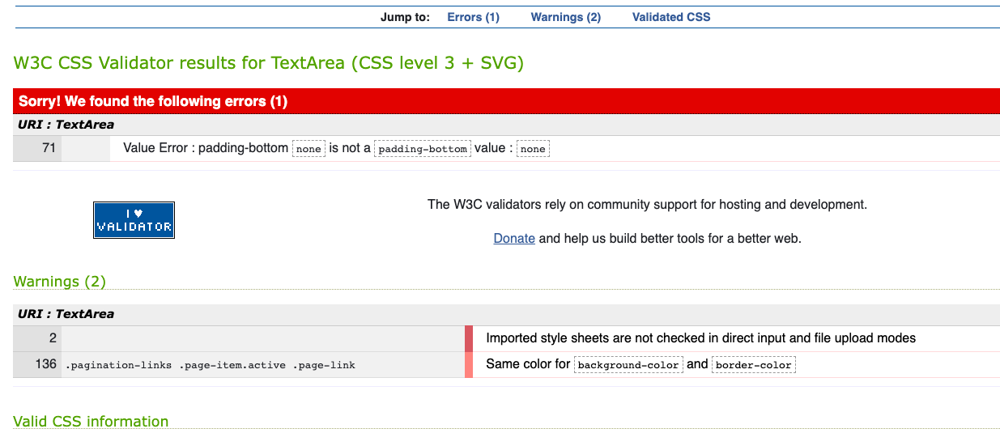

      Changed padding to 0 from none. Also changed border-color to match the other buttons.

    ### Final testing

      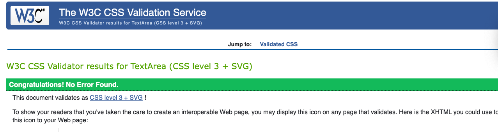
    

-   ## [JSHint JavaScript Validator](https://jshint.com/) 
    
    ### Initial/final testing
  
    - contact.js

      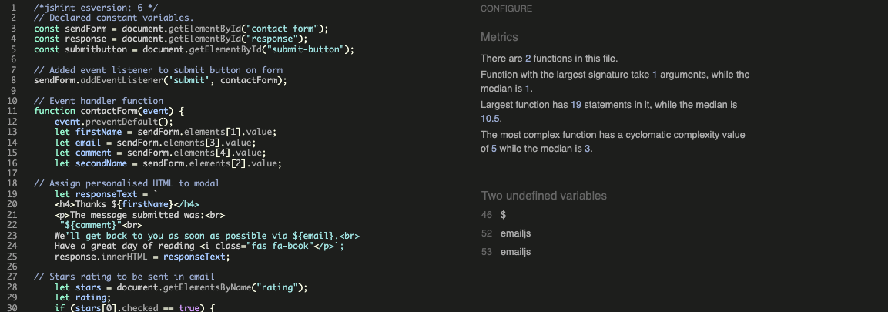

      Errors raised was undefined variables EmailJS and $. These didn't need defined as $ is for jquery and emailjs is an external API.

-   ## [Pep8 validation](http://pep8online.com/) 
    
    ### Initial/final testing
  
    - app.py 

      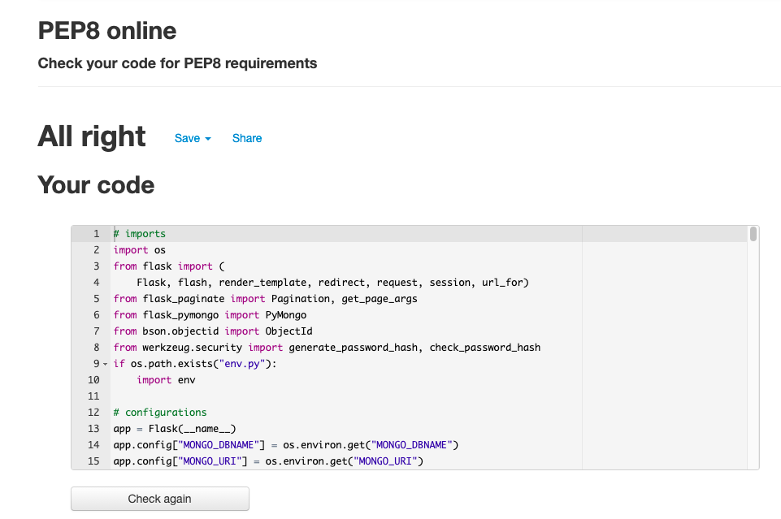

    
-   ## [Lighthouse](https://chrome.google.com/webstore/detail/lighthouse/blipmdconlkpinefehnmjammfjpmpbjk?hl=en) in devtools
    
    ### Initial scores 

    #### 

    + Initial mobile

    ### Actions taken from initial test.

    ### Final test 

    #### 

## Testing User Stories 

   - #### First Time Visitor 

      1. As a first time visitor, I want to easily understand the main purpose of the site. 
        The words bookcase and library are on the home page aswell as five books. There is also a nav link to the About page in the menu whch explains how to use the app.

         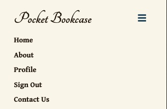
         
      2. As a first time visitor, I want to be able to intuitively use the site. 
         I have put social links and other useful links in the footer. The brand is a link to home and home is also in the menu which is expected by users. In the sign in page, sign-up link is also there incase user has not joined yet for ease of use and vice versa sign-in is on sign-up page.

         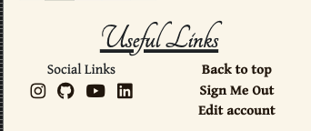

      3. As a first time visitor, I expect to see an attractive, visually appealing site. 
         I have used the same picture and colours all through the site so that there is nothing drastically different that could be off putting. Likewise none of the colours are jarring.  Have kept the design fairly simple as the book covers themselves add colours and imagery to the site so didnt want it to look too busy. Following on from that I have limited the number of books per page to 5 using pagination so that too many books aren't overwhelming to the user.  Didn't want any gaps in the site from lack of supplied url or a broken link and so supplied a back up image.

         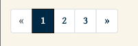
         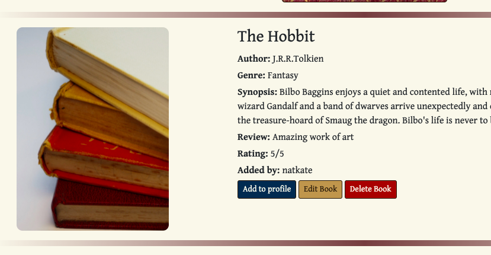

      4. As a first time visitor, I expect an accessible site. 
         All links have aria-labels, all images have alt text and icons are aria-hidden. Accessibility scores on lighthouse are 100.

      5. As a first time visitor, I expect the site to look good on my mobile device. 
         The site was built with mobile first in mind. I have hidden icons on the buttons for small screens as the buttons were taking up too much real estate. Also the book cover is on top of the book text rather than beside as otherwise the book image would be too small to fully appreciate the covers. But aim was that site would look good on all devices.

         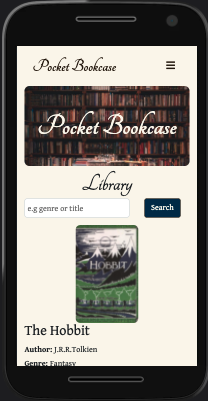
         
         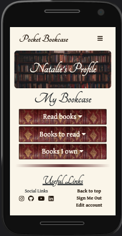
         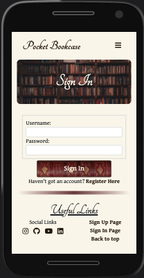
         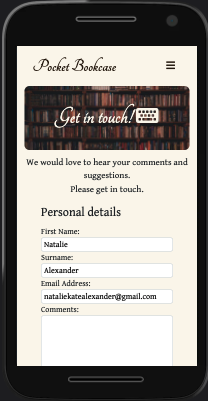
         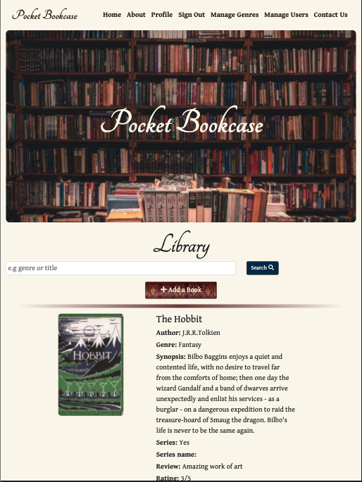
         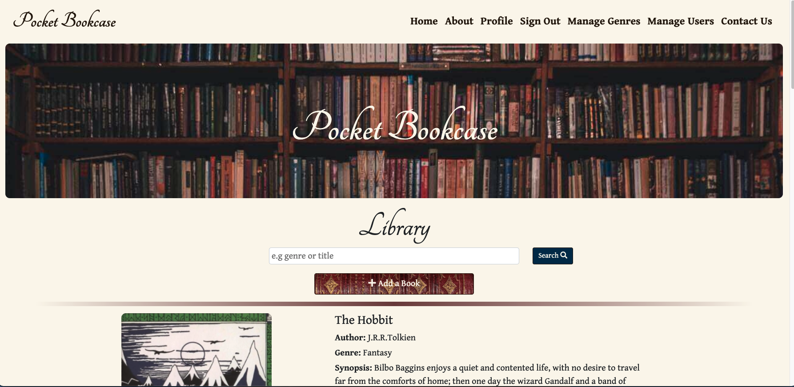

      6. As a first time visitor, I want to easily search the books. 
         The search bar is at the top of the home page, the user can use it to search for author, book title, books added by a certain user, book series name or genre.

         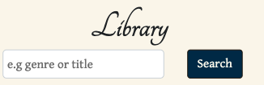

      7. As a first time visitor, I want to easily register. 
         There is a nav link in the menu to sign-up, aswell as in the footer, there is also another one on the sign-in page. When there, the registration form is no different from any other online forms and you won't be allowed to submit it without the required information. In addition there are tooltips so that username and password are the correct format.

         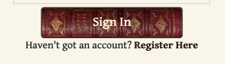
         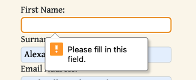
         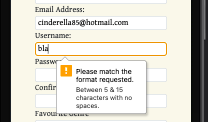

   - #### Returning Visitor Goals

      1. As a returning visitor, I want to add books to my "bookshelves".
         Next to every book is an 'Add to profile' button, which takes you to the add to profile page where user just has to answer two questions to determine which bookshelf or bookshelves to add book to.

         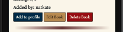
         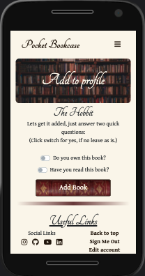

      2. As a returning visitor, I want to follow on social media so I can hear of any new features.
         Social media links are in the footer of all pages.

         

      3. As a returning visitor, I want to be able to add books to the applications library.
         Right at the top of the home page, above the library is a large 'Add Book' button which takes user to the add book form
         
         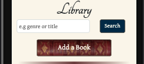
         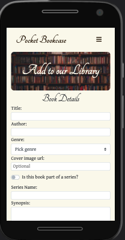
        
      4. As a returning visitor, I want to be able to change my password.
         In the footer on all pages is an 'Edit Account' link, this opens an edit account page which has a collapsible for change password. This is so that the user doesn't feel that if its there they have to fill it in ,which they may if it was part of the main form. 

         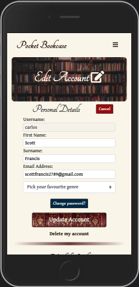
         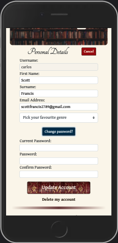
        
      5. As a returning visitor, I want to be able to rate the app.
         On contact form which is a nav link in the menu there is a section for rate us where you can select stars out of five.
        
         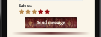
         
      6. As a returning visitor, I want to get feedback so I know that something has went through or if i've been redirected, why.
         When the contact form is submitted a submission modal pops up. In addition the user will get an email to acknowledge their message.  Also there are flash messages for logging out, moving books in your profile, editing books, genres, users and deleting books, genres and users. There are also flash messages for access e.g trying to access restricted pages, trying to edit a book that you didn't add and trying to perform an action which user is required to be logged in to perform. Others are for username already exists, book already exists in library, log in details don't match records etc.

         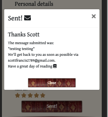
         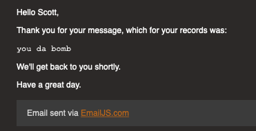
         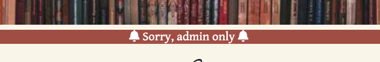
         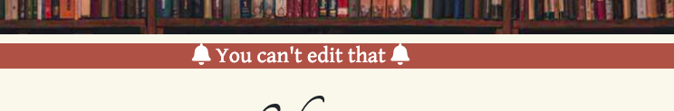
         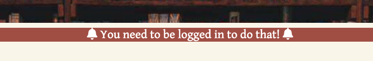
         

   - #### Frequent Visitor Goals

      1. As a frequent visitor, I want to be able to edit a book that I've added to the applications library.
         If the user has added a book to the library, an edit button will be available to the user beside the books they added. This button takes the user to the update book page. The form is prefilled so the user only has to edit the field they want to and not fill everything back in again.

         
         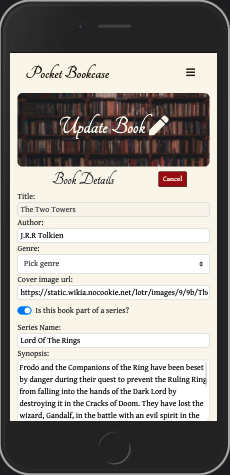

      2. As a frequent visitor, I want to be able to contact the owner with suggestions.
         Contact is a main nav link, this takes the user to the contact form which for logged in users is prefilled with the personal information. The comment box is available for users to submit a comment.

         

      3. As a frequent visitor, I want to be able to move or delete books on my "bookshelves".
         Its easy for a user to move books between bookshelves. Beside each book are buttons, if the user does not own a book then an 'Own' button is there to add it to the 'Books I own' bookshelf if the user then buys it.  In the Read books bookshelf, there is a 'Not Read' button which moves it to the 'Books to Read' bookshelf and vice versa. All books have a remove button to delete them from the users profile. 

         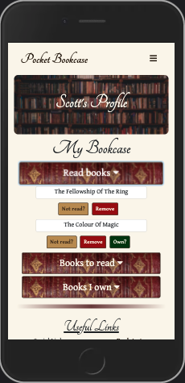

      4. As a frequent visitor, I want to be able to change my account information
         In the footer on all pages is an 'Edit Account' link, this opens an edit account page, they can change all details apart from the username, due to books being connected to the username.

         

      5. As a frequent visitor, I don't want to have never ending scrolling up or down.
         Made the bookshelves on profile page collapsible as quickly the number of books on all three bookshelves could become lengthy.  Added pagination for the library as again the number of books in it will just get longer and can become overwhelming.  In the footer of all pages there is a back to top link so user doesn't have to scroll to get back to the menu.

         
         
         

   - #### Admin goals
      
      1. As admin, I want to be able to add, delete or edit a book.
      2. As admin, I want to be able to add, delete or edit a genre.
      3. As admin, I want to be able to delete a user.
      4. As admin, I want to be able to make another user an admin.
      5. As admin, I want to be able to reset a users password if they're having trouble logging in.

## Manual Testing

-  The website was viewed with browsers: Google chrome, Safari, Microsoft Edge, Firefox, Opera and Internet Explorer. Viewed all pages on each and checked the following:
	- Nav links work from all three pages to all links.
	- Clicking on social links from all pages work, opening in a new tab
	- Clicking the start button loads the decisions.html and starts the timer.
   - Decision counter works correctly.
	- When the time runs out the start again button reloads decisions.html and timer starts.
	- Timer colour change and pulse effect at 0 works
	- For each result, correct information is shown.
	- All resource links open the correct page in a new tab.
	- For going out results, map shows instead of resources links
	- Map shows pins of results when location is either input in the search box or use my location button is used.
	- If geolocation not supported or blocked by users, alert box shows.
         + Alert box appearing below the map and so on mobile screens this wasn't obvious to the user and so moved it to pop up between the input box and map.
	- When pin is clicked open info window with Name of place and address.
         + When clicking on a second marker the original info window didn't close. It had done previously, realised when I was tidying up my code I had declared the infoWindow variable in the function where previously I had declared it at the top of my JS and so I changed it back.
	- The pictures that required an attribute had links that opened in a new tab to the correct places.
	- Hover effects work on social icons and all links and buttons.
         +  I had given one of my buttons a btn-hover instead of hover-btn class so fixed that. Had also not given the modal button the hover-btn class in contact.html so added that in too.
	- Form will not submit without all three required personal details being completed and comment box. Can type in text area, On successful form submission, personalised modal appears, both close buttons take user back to home page and star rating works.
         + Realised that the star ratings were being skipped over by keyboard control and screen reader and so added in a tab-index
	- Upon successful submission, receive an email with details taken from the form by email.js and send button has changed to sent.
         + I was getting a 412 error, when I went to my JS account it said I needed to reconnect my google account which as far as I could tell hadn't disconnected, created a new service which fixed the issue.
	- 404.html back to home button works.
	- 404 report issue link takes user to contact form.
	- About modal close buttons work.
   - Friends, family and slack peer review used. Devices and browsers were iphone 11: Safari (x3), iphone XS Max: Safari, iphone 6: Chrome, iphone XR: safari, iphone 11 Pro: Safari, iphone 10: Safari, Samsung S20 FE: Chrome, Samsung S10 and Sony Xperia I3: Chrome. 
        + There was a few comments about seeing the same option more than once, once I explained you start with 8, choose 4, then from those 4 you choose 2 and then pick from those 2, so the max you'll see one option is 3 times, they then understood what was going on. So I put a note on the landing page so people would know to expect to see some options more than once.
        + Another comment was that when the hover effect was transitioning it affected the neighbouring social link icons. I changed the structure of the footer so that the individual links were in individual columns and so the other icons weren't jostled about when another was hovered over.
        + Comment that tissue mask in pamper night result text was a typo. This highlighted that this isn't a well known beauty product so changed the wording to be clearer
   - Chrome devtools used to test responsiveness throughout the development process see bugs found below. Viewed all pages on all of the available devices at the end of the project to ensure everything still looked good.
   - Viewed physically on Macbook air 13", Huawei tablet, HP Chrome book, Dell 21" HD screen, iphone 11, Dell 17" laptop and Pixel 4XL phone to ensure that after all issues found and resolved that there was nothing else appearing
  
## Bugs

   ### Found and Fixed 

   In addition to the issues found in manual testing, I also found the below.

   -  On iphone 11 had a massive gap between content and footer, played about with margins, trying to fix it. Realised I had put margin of 10vh on both top and bottom, when I just wanted it on the top. 
   -  Footer was taking up more room that it should, it was escaping the container. Because I had changed the footer to put the icons in their own columns (see manual testing) bootstrap padding had been introduced, removed this.
   -  Realised that once I'd picked going out or staying in the top button was coming up with the same option every time. When I looked at the function, realised that when I had changed a variable name from length to arrayLength after it been flagged by the JSHint, I had only changed two out of three of the placed it had been used.
   -  On mobile the map obviously being smaller meant that the default satellite/ terrain options at the top left of the map were taking up alot of room and when an info window was opened, the information was being overlapped. Changed map type options to a dropdown menu using the Google Maps API documentation.

   ### Existing

   -  Colours not supported on internet explorer so everything is pretty much white. Looked into fixes for this but the slack community advised against it due to Internet explorer no longer being supported.
   -  Still not happy with the view on mobile. On dev tools all the mobile views look fine, no scrolling required. I have everything bar the footer in a container, min-height: 90vh and footer being 10vh. But on my phone I'm not seeing the social icons in the same view as the nav menu. I don't know if its because newer mobiles have full size screens but have overlays at the top and bottom. and thats why I'm not seeing everything, because they are included in the 100vh maybe? I tried changing heights in dev tools which just gives gaps. So i thought it best to stick with a bit of vertical scrolling than gaps.

  
  