# Testing

## Contents 
   - [Automated Testing](#automated-testing)
      * [HTML validation](#w3c-markup-validator)
      * [CSS validation](#w3c-css-validator)
      * [JS validation](#jshint-javascript-validator)
      * [Lighthouse testing](#lighthouse-in-devtools)
   - [Testing User Stories](#testing-user-stories)
   - [Manual testing](#manual-testing)
   - [Bugs](#bugs)
      * [Found and Fixed](#found-and-fixed)
      * [Existing](#existing)

## Automated Testing

The W3C Markup Validator and W3C CSS Validator were used to validate every page of the project to ensure there were no syntax errors in the project.

-   ## [W3C Markup Validator](https://validator.w3.org/) 

    ### Initial testing
    - index.html

    

    - about.html

    

    - contact.html

     

     I was getting warnings for using aria-checked on my radio buttons, I googled it and seems common practice to do so and couldn't see an alternative so I left them in.
  
    - edit-account.html

     

    - edit-user.html

     

     Had an extra closing div and form tag so removed them.

    - manage-genres.html

     

     Had misplaced a " and so this was causing some issues, put in the correct place. Duplicate id error was coming from forgetting that a list was getting iterated and so numerous genres were getting the same id. So changed to what I had done in other pages and made the id's the genre names.

    - manage-users.html

     

     Hadn't left a space after an attribute which due to iteration meant numerous lines were missing a space.

    - profile.html

     

     Had two divs for each of the profile bookshelves as the same id. These were the books and if there weren't any the link to the library. As they wouldn't both get shown at the same time it hadn't occurred to me that it would be an issue. Put both divs in one div with conditions to dictate which got shown when the collapsible was toggled.

    - profile-add.html

     

    - register.html

     

    - sign-in.html

     

    - edit-book.html

     

     Same issue as contact.html, with the aria-checked attribute.

    - add-book.html

     

     Same issue as contact.html, with the aria-checked attribute.

    - 404.html

     

    - 500.html

      Issues raised by inputting the 500.html code was due to the templating language and therefore raised errors of needing a head, doctype, language etc.
    
    ### Final testing (for those that needed fixed)

    - manage-genres.html
    
     

   - manage-users.html
    
     

   - profile.html
    
     

   - edit-user.html
    
     

-   ## [W3C CSS Validator](https://jigsaw.w3.org/css-validator/#validate_by_input) 
    
    ### Initial testing

      

      Changed padding to 0 from none. Also changed border-color to match the other buttons.

    ### Final testing

      
    

-   ## [JSHint JavaScript Validator](https://jshint.com/) 
    
    ### Initial/final testing
  
    - contact.js

      

      Errors raised was undefined variables EmailJS and $. These didn't need defined as $ is for jquery and emailjs is an external API.

-   ## [Pep8 validation](http://pep8online.com/) 
    
    ### Initial/final testing
  
    - app.py 

      

    
-   ## [Lighthouse](https://chrome.google.com/webstore/detail/lighthouse/blipmdconlkpinefehnmjammfjpmpbjk?hl=en) in devtools
    
    ### Initial scores 

    #### 

    + Initial mobile

    ### Actions taken from initial test.

    ### Final test 

    #### 

## Testing User Stories 

   - #### First Time Visitor 

      1. As a first time visitor, I want to easily understand the main purpose of the site. 
        The words bookcase and library are on the home page aswell as five books. There is also a nav link to the About page in the menu whch explains how to use the app.

         
         
      2. As a first time visitor, I want to be able to intuitively use the site. 
         I have put social links and other useful links in the footer. The brand is a link to home and home is also in the menu which is expected by users. In the sign in page, sign-up link is also there incase user has not joined yet for ease of use and vice versa sign-in is on sign-up page.

         

      3. As a first time visitor, I expect to see an attractive, visually appealing site. 
         I have used the same picture and colours all through the site so that there is nothing drastically different that could be off putting. Likewise none of the colours are jarring.  Have kept the design fairly simple as the book covers themselves add colours and imagery to the site so didnt want it to look too busy. Following on from that I have limited the number of books per page to 5 using pagination so that too many books aren't overwhelming to the user.  Didn't want any gaps in the site from lack of supplied url or a broken link and so supplied a back up image.

         
         

      4. As a first time visitor, I expect an accessible site. 
         All links have aria-labels, all images have alt text and icons are aria-hidden. Accessibility scores on lighthouse are 100.

      5. As a first time visitor, I expect the site to look good on my mobile device. 
         The site was built with mobile first in mind. I have hidden icons on the buttons for small screens as the buttons were taking up too much real estate. Also the book cover is on top of the book text rather than beside as otherwise the book image would be too small to fully appreciate the covers. But aim was that site would look good on all devices.

         
         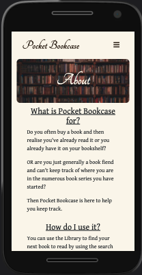
         
         
         
         
         

      6. As a first time visitor, I want to easily search the books. 
         The search bar is at the top of the home page, the user can use it to search for author, book title, books added by a certain user, book series name or genre.

         

      7. As a first time visitor, I want to easily register. 
         There is a nav link in the menu to sign-up, aswell as in the footer, there is also another one on the sign-in page. When there, the registration form is no different from any other online forms and you won't be allowed to submit it without the required information. In addition there are tooltips so that username and password are the correct format.

         
         
         

   - #### Returning Visitor Goals

      1. As a returning visitor, I want to add books to my "bookshelves". 
         Next to every book is an 'Add to profile' button, which takes you to the add to profile page where user just has to answer two questions to determine which bookshelf or bookshelves to add book to.

         
         

      2. As a returning visitor, I want to follow on social media so I can hear of any new features. 
         Social media links are in the footer of all pages.

         

      3. As a returning visitor, I want to be able to add books to the applications library. 
         Right at the top of the home page, above the library is a large 'Add Book' button which takes user to the add book form
         
         
         
        
      4. As a returning visitor, I want to be able to change my password. 
         In the footer on all pages is an 'Edit Account' link, this opens an edit account page which has a collapsible for change password. This is so that the user doesn't feel that if its there they have to fill it in ,which they may if it was part of the main form. 

         
         
        
      5. As a returning visitor, I want to be able to rate the app. 
         On contact form which is a nav link in the menu there is a section for rate us where you can select stars out of five.
        
         
         
      6. As a returning visitor, I want to get feedback so I know that something has went through or if i've been redirected, why. 
         When the contact form is submitted a submission modal pops up. In addition the user will get an email to acknowledge their message.  Also there are flash messages for logging out, moving books in your profile, editing books, genres, users and deleting books, genres and users. There are also flash messages for access e.g trying to access restricted pages, trying to edit a book that you didn't add and trying to perform an action which user is required to be logged in to perform. Others are for username already exists, book already exists in library, log in details don't match records etc.

         
         
         
         
         
         

   - #### Frequent Visitor Goals

      1. As a frequent visitor, I want to be able to edit a book that I've added to the applications library. 
         If the user has added a book to the library, an edit button will be available to the user beside the books they added. This button takes the user to the update book page. The form is prefilled so the user only has to edit the field they want to and not fill everything back in again.

         
         

      2. As a frequent visitor, I want to be able to contact the owner with suggestions. 
         Contact is a main nav link, this takes the user to the contact form which for logged in users is prefilled with the personal information. The comment box is available for users to submit a comment.

         

      3. As a frequent visitor, I want to be able to move or delete books on my "bookshelves". 
         Its easy for a user to move books between bookshelves. Beside each book are buttons, if the user does not own a book then an 'Own' button is there to add it to the 'Books I own' bookshelf if the user then buys it.  In the Read books bookshelf, there is a 'Not Read' button which moves it to the 'Books to Read' bookshelf and vice versa. All books have a remove button to delete them from the users profile. 

         

      4. As a frequent visitor, I want to be able to change my account information 
         In the footer on all pages is an 'Edit Account' link, this opens an edit account page, they can change all details apart from the username, due to books being connected to the username.

         

      5. As a frequent visitor, I don't want to have never ending scrolling up or down. 
         Made the bookshelves on profile page collapsible as quickly the number of books on all three bookshelves could become lengthy.  Added pagination for the library as again the number of books in it will just get longer and can become overwhelming.  In the footer of all pages there is a back to top link so user doesn't have to scroll to get back to the menu.

         
         
         

   - #### Admin goals
      
      1. As admin, I want to be able to add, delete or edit a book. 
         For admin one they are logged in they will see the add book button like any other user.
         Admin will have all three buttons beside every book not just the one they themselves have added to library. The admins update user allows admin to update ook title which a normal user cannot.

        
        
        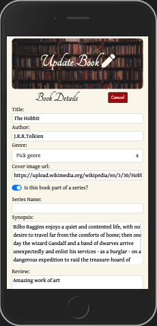
        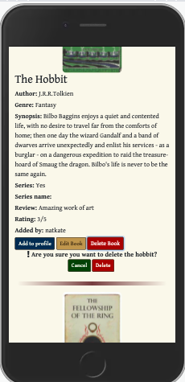

      2. As admin, I want to be able to add, delete or edit a genre. 
         Admin has a manage genre page which is a nav link in their main menu. Here they can edit a genre via a collapsible text box which is prefilled. They can also delete a genre after confirmation. There is also an add genre text input field.

         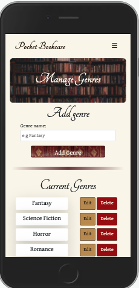
         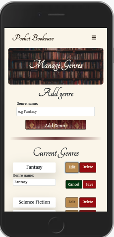
         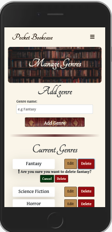

      3. As admin, I want to be able to delete a user. 
         Admin has a mange user page via their menu. Beside each user there is delete button which opens a confirmation collapsible with a cancel if it was a mistake or a delete button to delete the user.

         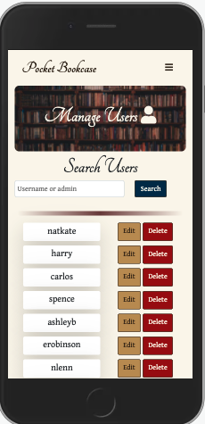
         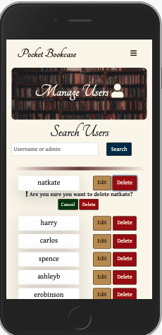
         
      4. As admin, I want to be able to make another user an admin. 
         Beside each username on the manage users page there is an edit button, this opens the edit user page which has a switch for turning on admin capabilites for a user.

         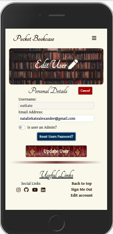

      5. As admin, I want to be able to reset a users password if they're having trouble logging in. 
         Beside each username on the manage users page there is an edit button, this opens the edit user page. If a user requests help logging in, the admin can open the reset password in edit user page and make a new password for them. They are then reminded to email user with new password, and they will be told to change it again themselves.
         
         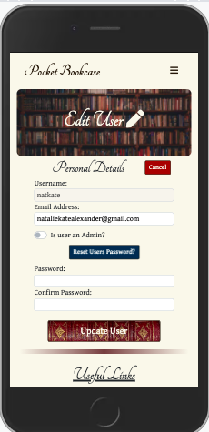
         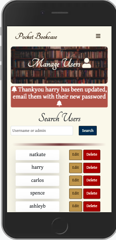
         
      
## Manual Testing

-  The website was viewed with browsers: Google chrome, Safari, Microsoft Edge, Firefox and Opera. Viewed all pages on each and checked the following:
  - Nav links work from all three pages to all links.
  - Book search bar works for genre, added_by, series, book title and author 
  - Pagination links work.
  - All buttons take user to the correct page
  - Add book button should only show for logged in user.
  - Add book form doesn't allow user to add book without required fields being completed.
  - Add book form doesn't allow a book that already exists in library to be added.
    * Yes and no, if you spell it exactly the same then it won't let you, but if there is a letter different or you miss out "The" at the beginning for example it can get added when really its the same book.
  - Add book form doesn't allow a book with spaces as a name to be added.
  - Book successfully added to library
  - If book url not supplied or broken, back up image shown.
  - Flash messages pop up where required, providing feedback to users actions.
  - Correct buttons appear for the correct users beside books. e.g all three for admin, two against book that a user added, one for logged in users, none for non logged in users.
  - Edit book form should prefill with current details, title should not be able to be edited except for admin.
  - Edit book form will not sumbit wihout required information.
  - Book information successfully edited.
  - Delete book, only allowed for admin, confirmation before deletion required, successfully deleted from library.
  - Registration form won't submit without required information.
  - Registration successfully adds a new user and their profile.
  - Add to profile switches put books on the correct profile bookshelves.
  - If user adds a book to profile that they have already added, duplicate book should not appear.
      * When testing, added a book to profile, then went back and added same book selecting the same options, this as expected didn’t give duplicate books in profile list. Then went back and added same book again, this time not selecting either switch. This resulted in the book being in the read and to read books. Added in a check to see if book is in profile already, if it is flash message will appear and user won't be taken to profile-add page.
  - Using book buttons on profile should move books correctly. Remove button should remove book from that bookshelf only.
  - Edit account form should be pre-filled with existing information (not password)
  - Edit account should successfully update a users information.
  - Delete account should open confirmation and then successfully remove user if they proceed with deletion.
     * Link did not open confirmation, had missed a # in the href to target the collapsible.
  - If user tries to change their password, their existing password must be correct to proceed. And their new password must match the confirm password field.
  - Edit account page allows a user to delete their account after confirmation
  - Manage genre page allows admin to successfully add a new genre.
  - Manage genre page allows admin to update a genre.
  - Manage genre page allows admin to successfully delete a genre after confirmation
  - Manage users allows admin to search for admin users or a user by username.
  - Manage users page allows admin to open a users edit user page to successfully make then an admin.
  - Manage users page allows admin to open a users edit user page to successfully reset their password.
  - Manage users page allows admin to successfully delete a user after confirmation.
  - Cancel buttons take user of of the edit page they were on or close the delete confirmation.
  - Clicking on social links work, opening in a new tab.
  - Footer links all go to the correct place, back to top link correct on each page.
  - Footer links appearing appropriately, logged in vs non logged. 
  - Hover effects work on social icons and all links and buttons.
  - Contact form will not submit without all three required personal details and comment box being completed . Can type in text area, On successful form submission, personalised modal appears, both close buttons take user back to home page and star rating works.
  - Upon successful submission, receive an email with details taken from the form by email.js and send button has changed to sent.
  - Upon contact form submission user also recieves a personalised acknowledgment email.
  - 404.html back to home button works.
  - 404 report issue link takes user to contact form.
  - About modal close buttons work.
  - Friends, family and slack peer review used. Devices and browsers were iphone 11: Safari (x3), iphone XS Max: Safari, iphone 6: Chrome, iphone XR: safari, iphone 11 Pro: Safari, iphone 10: Safari, Samsung S20 FE: Chrome, Samsung S10 and Sony Xperia I3: Chrome. 
  - Chrome devtools used to test responsiveness throughout the development process see bugs found below. Viewed all pages on all of the available devices at the end of the project to ensure everything still looked good.
  - Viewed physically on Macbook air 13", Huawei tablet, HP Chrome book, Dell 21" HD screen, iphone 11, Dell 17" laptop and Pixel 4XL phone to ensure that after all issues found and resolved that there was nothing else appearing
  
## Bugs

   ### Found and Fixed 

   ### Existing

